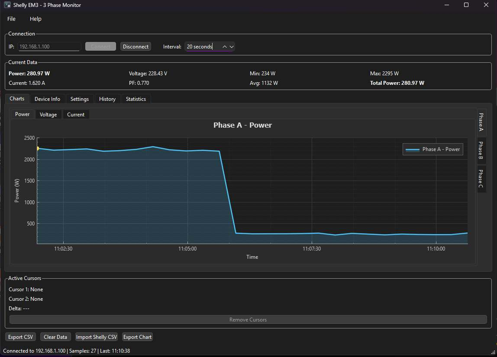

# Shelly EM3 3-Phase Monitor + Device Info + Settings + History

Desktop application in C++ with Qt to monitor and log energy consumption of all 3 phases of a Shelly EM3 device via HTTP API, with complete device diagnostics, advanced configuration and historical data visualization with SQLite database.


## Features

### 📊 Electrical Monitoring (v2.0/v2.1)
- ✅ **Complete 3-phase monitoring** (Phase A, B, C)
- ✅ **9 interactive charts** (3 phases × 3 parameters: Power/Voltage/Current)
- ✅ **Modern dark theme** with QCustomPlot
  - Ergonomic dark gray background (#2b2b2b / #1e1e1e)
  - Distinct colors per phase: A=cyan (#4fc3f7), B=orange (#ffb74d), C=green (#81c784)
  - Much less tiring for extended monitoring sessions
- ✅ **Vertical tabs on the right** for phase selection
- ✅ **Horizontal sub-tabs** for parameters (Power/Voltage/Current)
- ✅ **Independent interactive cursors** for each chart
  - **Native Qt tooltip** (v2.4.1): OS native tooltip with all data (timestamp, power, voltage, current, PF) in HTML format
  - **Yellow marker** (v2.4.1): Yellow circle indicating exact position on chart during hover
  - Up to 2 colored fixed cursors (red/green) for value comparison with click
  - Automatic delta calculation between cursors (power and time)
- ✅ **Total Power** label with sum of all 3 phases
- ✅ **Real-time statistics** (Min, Max, Average) for selected phase
- ✅ **Multi-phase CSV export** (15 columns + TotalPower)

### 🔧 Device Info (v2.1)
- ✅ **"Device Info" tab** with 5 thematic sub-tabs:
  - **General**: Model (SHEM-3), firmware version, IP, MAC, formatted uptime, last update
  - **WiFi**: SSID, RSSI with quality bars (▂▄▆█), connection/cloud status
  - **System**: RAM/Storage usage (%), temperature with colored alarms
  - **Energy**: Total kWh per phase + total aggregated + returned energy
  - **Diagnostics**: Neutral current, phase imbalance (%), firmware updates
- ✅ **Automatic auto-refresh** on connection start
- ✅ **Manual refresh** via dedicated button
- ✅ **Colored indicators** (green/red/orange) for status and alarms

### ⚙️ Settings Tab (v2.2/v2.4/v2.5.1)
- ✅ **"Settings" tab** with 4 sub-tabs for complete configuration:
  - **General**: Default polling interval (5-300s), Auto-save enable/disable, Auto-save interval (1-60min)
  - **Language**: Language selection (EN, IT, FR, DE, ES) with Apply button
  - **Alarms**:
    - Temperature alarm (40-100°C)
    - Phase imbalance (5-50%)
    - **Power threshold alarms (3-phase)** (v2.5.1): Independent enable/threshold per phase A, B, C (100-10000W)
    - **Low power alarms (3-phase)**: Independent enable/threshold per phase A, B, C (0-500W)
  - **Advanced**: Theme selection (Dark/Light), Debug mode, History Charts type (Line/Bar), Database Maintenance, Reset settings button
- ✅ **3-Phase Alarm System** (v2.5.1):
  - **Independent configuration**: Each phase has its own checkbox and threshold setting
  - **Horizontal layout**: Clean 2-row grid layout (checkboxes + thresholds) for both high and low power alarms
  - **Visual notifications**: Status bar alerts when phase power exceeds/drops below threshold
  - **Automatic clear**: Alarms automatically clear when values return to normal
  - **Persistent storage**: All alarm settings saved in QSettings
- ✅ **Database Maintenance** (v2.4):
  - **Info display**: Database path, size (MB), records count (samples + daily energy)
  - **Compact Database**: VACUUM to optimize space
  - **Backup Database**: Create backup copy with automatic timestamp
  - **Clear Old Data**: Delete samples older than N days (1-3650)
- ✅ **Optimized 2x2 grid layout** for maximum vertical space (v2.4)
- ✅ **Persistent storage** with QSettings (Windows Registry)
- ✅ **Save/Cancel buttons** with change confirmation
- ✅ **MainWindow integration** to apply settings in real-time

### 📈 History Tab + Auto-Save Database (v2.3)
- ✅ **SQLite database** for historical data persistence (`shelly_history.db`)
- ✅ **Continuous auto-save**: Every acquired sample is automatically saved to database in real-time
- ✅ **Query Parameters**: Date/time range picker, phase filter, query type selector
- ✅ **Dual View** with Table/Chart tabs for flexible visualization
- ✅ **Table View**:
  - Sortable columns, automatic scrollbars
  - Compact display (1000 visible rows limit)
  - Export query results to CSV
- ✅ **Chart View - Interactive Graphs**:
  - Real-time samples: Power (W) vs Time (configurable line/bar charts)
  - Daily energy: Energy (kWh) vs Date (configurable line/bar charts)
  - Chart type selection via Settings → Advanced → History Charts
  - Multi-phase overlay (3 colored lines/bars with legend)
  - Single-phase focused view
  - Interactive Zoom & Pan
  - DateTime axis with automatic formatting
  - Dynamic bar width based on sampling interval
- ✅ **Statistics Panel**: Record count, date range, power/energy stats per phase
- ✅ **Shelly Cloud CSV Import**:
  - Multi-section parser for daily energy files from mobile app
  - Automatic INSERT OR REPLACE (no duplicates)
  - Insert vs update tracking with summary message

### 📊 Statistics Tab - Temporal Aggregations (v2.5)
- ✅ **"Statistics" tab** with advanced historical consumption analysis:
  - **Temporal Aggregations**: Data aggregation by time intervals (Hourly, Daily, Weekly, Monthly)
  - **Time Range Selection**: Calendar widgets for precise start/end date selection
  - **Quick Range Buttons**: Fast shortcuts (Today, Last 7/30 Days, This/Last Month)
  - **Summary Statistics**: Total energy, average/peak power, total cost with automatic calculation
  - **Energy Cost Calculation**: Configurable price €/kWh (default 0.25) with real-time cost calculation
  - **Interactive Charts**: QCustomPlot chart with energy consumed per period (zoom/pan) with **dark theme** (#2b2b2b / #1e1e1e)
  - **Detailed Data Table**: Table with complete breakdown per phase (A/B/C) and aggregate statistics
  - **Period Comparison**: Automatic comparison between current and previous period
  - **Trend Analysis**: Automatic trend detection (↑ Increasing, ↓ Decreasing, → Stable) with 5% threshold
  - **Percentage Changes**: Percentage variation calculation for energy, power and cost
  - **Color-coded Indicators**: Visual colored indicators (red=increase, green=decrease)
  - **CSV Export**: Export aggregate statistics in CSV format
  - **Chart Export**: Export energy chart to PNG (Full HD) or PDF (A4 landscape)
- ✅ **Database Aggregation Engine**:
  - SQL GROUP BY with strftime() for efficient temporal grouping
  - Automatic energy calculation from average power: Energy (Wh) = Power (W) × Time (h)
  - Complete statistics per phase: min/max/avg for power/voltage/current/powerFactor
  - Multi-period comparison support with automatic delta calculation

### ⚙️ General
- ✅ **Configurable polling** (5-300 seconds) - configurable via Settings Tab
- ✅ **Automatic settings save** (QSettings)
- ✅ **Automatic data persistence**: Every sample saved to SQLite without user intervention
- ✅ **Window geometry persistence** (v2.4): Position, size and window state saved automatically
- ✅ **Help menu** (v2.4.1): Menu bar with About Shelly Logger, About Qt, View Logs (Ctrl+L)
- ✅ **Multi-language support** (i18n): English, Italiano, Français, Deutsch, Español
- ✅ **Error handling** with automatic disconnection after 3 consecutive errors
- ✅ **Alarm system** (v2.4/v2.5.1): Temperature, phase imbalance, 3-phase power threshold (high/low) with visual notifications

## Screenshots

### Main Interface - Real-Time Monitoring



**Features shown:**
- Dark theme with ergonomic color scheme
- Real-time power chart for Phase A (cyan line)
- Connection panel with IP and polling interval
- Current data display (Power, Voltage, Current, Power Factor)
- Statistics panel (Min, Max, Average, Total Power)
- Tab navigation (Charts, Device Info, Settings, History, Statistics)
- Multi-parameter sub-tabs (Power, Voltage, Current)
- Active cursors panel for data inspection
- Action buttons (Export CSV, Clear Data, Import Shelly CSV, Export Chart)
- Status bar showing connection info and sample count

## Requirements

### Required Software

- **Qt 6.9.1** (with MinGW 64-bit)
  - Installation: `C:\Qt\6.9.1\mingw_64`
  - Download: https://www.qt.io/download

- **QCustomPlot 2.1.1+**
  - See instructions in [DOWNLOAD_QCUSTOMPLOT.md](DOWNLOAD_QCUSTOMPLOT.md)

### Hardware

- **Shelly EM3** device configured and connected to local network
- Windows PC with access to the network where the Shelly is located

## Installation

### 1. Clone or download the repository

```bash
cd D:\SwDev
git clone <repository-url> ShellyLogger
cd ShellyLogger
```

### 2. Download QCustomPlot

Follow instructions in [DOWNLOAD_QCUSTOMPLOT.md](DOWNLOAD_QCUSTOMPLOT.md) to download the files:
- `qcustomplot.h`
- `qcustomplot.cpp`

Copy these files to the main project folder.

### 3. Verify project structure

```
D:\SwDev\ShellyLogger\
├── shelly_logger.pro
├── main.cpp
├── mainwindow.h/cpp
├── shellymanager.h/cpp
├── datapoint.h
├── deviceinfo.h            ← v2.1
├── deviceinfotab.h/cpp     ← v2.1
├── settingstab.h/cpp       ← v2.2/v2.4/v2.5.1 (Database Maintenance + 3-phase alarms)
├── alarmmanager.h/cpp      ← v2.4 Alarm system
├── databasemanager.h/cpp   ← v2.3/v2.4/v2.5 SQLite database + maintenance + aggregations
├── historyviewertab.h/cpp  ← v2.3 History Tab with charts
├── shellycsvimporter.h/cpp ← v2.3 CSV Parser
├── aggregateddata.h        ← v2.5 Data structures for temporal aggregations
├── statisticstab.h/cpp     ← v2.5 Statistics Tab with trend analysis
├── qcustomplot.h/cpp       ← Downloaded
└── README.md
```

## Compilation

### Option 1: Qt Creator (Recommended)

1. Open **Qt Creator**
2. File → Open File or Project → `shelly_logger.pro`
3. Configure kit: **Desktop Qt 6.9.1 MinGW 64-bit**
4. Select build configuration: **Debug**
5. Build → Build Project (Ctrl+B)
6. Run → Run (Ctrl+R)

### Option 2: Command Line (MinGW)

**Prerequisites:** MinGW is located in `C:\Qt\Tools\mingw1310_64\bin\`

Generate Makefile:

```cmd
cd D:\SwDev\ShellyLogger
"C:\Qt\6.9.1\mingw_64\bin\qmake.exe" shelly_logger.pro -spec win32-g++ "CONFIG+=debug"
```

Compile:

```cmd
"C:\Qt\Tools\mingw1310_64\bin\mingw32-make.exe"
```

Run:

```cmd
debug\shelly_logger.exe
```

### Clean and Rebuild

```cmd
"C:\Qt\Tools\mingw1310_64\bin\mingw32-make.exe" clean
"C:\Qt\6.9.1\mingw_64\bin\qmake.exe" shelly_logger.pro -spec win32-g++ "CONFIG+=debug"
"C:\Qt\Tools\mingw1310_64\bin\mingw32-make.exe"
```

## Usage

### Shelly EM3 Configuration

1. Ensure Shelly EM3 is connected to local network
2. Find the device IP address (e.g.: `192.168.1.100`)
3. Verify the endpoint is reachable:
   ```
   http://192.168.1.100/status
   ```

### Application Startup

1. Launch `shelly_logger.exe`
2. Enter Shelly IP in the "IP" field
3. Set sampling interval (default: 60 seconds)
4. Click **Connect**
5. Charts will start populating with real-time data
6. **Device Info** will automatically update

### Main Features

#### Charts Tab - Multi-parameter charts

- **Vertical tabs** (on the right): Select phase (A, B, C)
- **Horizontal sub-tabs** (on top): Select parameter (Power, Voltage, Current)
- **Each chart** has independent cursors and zoom
- **Current Data** shows values for selected phase/parameter
- **Total Power** shows sum of all 3 phases

#### Device Info Tab - Complete diagnostics

- **Manual refresh**: Click on "Refresh Device Info"
- **5 sub-tabs** with organized information:
  - General, WiFi, System, Energy, Diagnostics
- **Colored alarms**: Red/orange for issues, green for OK

#### Settings Tab - Advanced configuration

- **4 sub-tabs** for complete configuration:
  - **General**: Set default polling interval, enable periodic auto-save
  - **Language**: Select interface language (restart required for some strings)
  - **Alarms**: Configure alarm thresholds
    - **Temperature**: Device overheating alarm (40-100°C)
    - **Phase Imbalance**: Excessive phase imbalance alarm (5-50%)
    - **Power Threshold Alarms (3-phase)**: High power alarms - independent enable and threshold for each phase A, B, C (100-10000W)
    - **Low Power Alarms (3-phase)**: Low power alarms - independent enable and threshold for each phase A, B, C (0-500W) with audible beep
  - **Advanced**: Theme selection, debug mode, History Charts type, Database Maintenance, reset settings
- **3-Phase Alarm Configuration**:
  - Each phase (A, B, C) has its own checkbox to enable/disable alarm
  - Each phase has independent threshold setting
  - Alarms trigger visual status bar notifications when power exceeds (high) or drops below (low) threshold
  - Alarms automatically clear when values return to normal range
  - All settings are saved persistently in Windows Registry
- **Database Maintenance** (Advanced tab):
  - **Info display**: Display database path, size (MB), record count
  - **Compact**: Compact database with VACUUM to free space
  - **Backup**: Create backup with automatic timestamp name (e.g.: `shelly_history_backup_20250101_143522.db`)
  - **Clear Old Data**: Delete samples older than N days with double confirmation
- **Save button**: Save all changes to QSettings (Windows Registry)
- **Cancel button**: Cancel changes and restore saved values
- **Integration**: Saved settings are automatically applied (e.g.: default polling interval)

#### Interactive cursors

- **Mouse hover** (v2.4.1 improved): Hover mouse over chart to see:
  - **Qt native tooltip**: Shows timestamp, power, voltage, current, PF formatted in HTML
  - **Yellow marker**: Yellow circle (#ffd54f) indicating exact position on chart
  - Real-time update as mouse moves
- **Left click**: Add fixed cursor (maximum 2 per chart)
- **Double click**: Reset chart zoom
- **Remove Cursors**: Button to remove all fixed cursors

#### Data export

**CSV Export** (Charts Tab):
1. Click **Export CSV** (visible only in Charts tab)
2. Choose file name and location
3. File will contain all acquired data with format:
   ```csv
   Timestamp,Date,Time,PowerA(W),VoltageA(V),CurrentA(A),PFA,PowerB(W),VoltageB(V),CurrentB(A),PFB,PowerC(W),VoltageC(V),CurrentC(A),PFC,TotalPower(W)
   2024-12-29 15:30:00,2024-12-29,15:30:00,1250.50,230.00,5.435,0.998,980.20,229.50,4.270,0.995,1120.80,231.00,4.865,0.997,3351.50
   ```

**Chart Export** (Charts and Statistics tabs):
1. Click **Export Chart** (visible in Charts and Statistics tabs)
2. Choose format: PNG (Full HD 1920x1080) or PDF (A4 landscape 297x210mm)
3. File will be saved with automatic context-based name:
   - Charts: `chart_PhaseA_Power_2025-01-03_145530.png`
   - Statistics: `chart_Statistics_2025-01-03_145530.pdf`

#### Button visibility per tab

The interface shows only relevant buttons for each tab:

| Button | Charts | Device Info | Settings | History | Statistics |
|--------|--------|-------------|----------|---------|------------|
| Export CSV | ✅ | ❌ | ❌ | ❌ | ❌ |
| Clear Data | ✅ | ❌ | ❌ | ❌ | ❌ |
| Import Shelly CSV | ✅ | ✅ | ✅ | ✅ | ✅ |
| Export Chart | ✅ | ❌ | ❌ | ❌ | ✅ |

*Note: History and Statistics have their own dedicated Export CSV buttons*

#### Clear data

Click **Clear Data** (only in Charts tab) to clean buffer and start over (requires confirmation).

## Configuration

Settings are automatically saved to:

**Windows**: `HKEY_CURRENT_USER\Software\ShellyLogger\MainWindow`

Settings saved from Settings Tab (v2.2/v2.4/v2.5.1):
- **General**: Default polling interval, auto-save enable/interval
- **Language**: Selected language
- **Alarms**: Thresholds and enable/disable for temperature, phase imbalance, 3-phase power (high/low)
- **Advanced**: Theme, debug mode, History Charts type (Line/Bar)

Automatically saved settings (v2.4):
- Last used IP (from Connection section)
- Last polling interval (from Connection section)
- **Window geometry**: Position, size and state (maximized/normal) of main window

## Translations / i18n

The application supports internationalization (i18n) via Qt Linguist.

### Available Languages

- **English** (en) - Default language
- **Italiano** (it) - Configurable
- **Français** (fr) - Configurable
- **Deutsch** (de) - Configurable
- **Español** (es) - Configurable

### Generate/Update Translations

To update translation files after code changes:

```cmd
"C:\Qt\6.9.1\mingw_64\bin\lupdate.exe" shelly_logger.pro
```

### Translate the Application

1. Open `.ts` files in `translations/` with Qt Linguist
2. Translate strings
3. Save file

### Compile Translations

```cmd
"C:\Qt\6.9.1\mingw_64\bin\lrelease.exe" shelly_logger.pro
```

This generates binary `.qm` files ready for use.

## Shelly EM3 API

The application uses the HTTP GET endpoint:

```
http://{IP_ADDRESS}/status
```

JSON response (example with 3 phases):

```json
{
  "emeters": [
    {
      "power": 1250.50,
      "voltage": 230.00,
      "current": 5.435,
      "pf": 0.998,
      "is_valid": true
    },
    {
      "power": 980.20,
      "voltage": 229.50,
      "current": 4.270,
      "pf": 0.995,
      "is_valid": true
    },
    {
      "power": 1120.80,
      "voltage": 231.00,
      "current": 4.865,
      "pf": 0.997,
      "is_valid": true
    }
  ],
  "wifi_sta": { ... },
  "ram_total": 51248,
  "ram_free": 39504,
  ...
}
```

The application reads data from **all 3 phases** (`emeters[0-2]`) and many other information for Device Info.

## Code Structure

| File | Description |
|------|-------------|
| `main.cpp` | Application entry point |
| `mainwindow.h/cpp` | Main GUI interface with 9 charts and Device Info tab |
| `shellymanager.h/cpp` | HTTP communication management with Shelly EM3 (data + device info) |
| `datapoint.h` | Data structure for 3-phase samples (12 fields) |
| `deviceinfo.h` | Device information data structure (30+ fields + helpers) |
| `deviceinfotab.h/cpp` | Device Info widget with 5 sub-tabs |
| `settingstab.h/cpp` | Settings widget with 4 sub-tabs, QSettings persistence and database maintenance |
| `alarmmanager.h/cpp` | Alarm management (temperature, phase imbalance, power threshold) |
| `databasemanager.h/cpp` | SQLite database management for historical data + maintenance + aggregations |
| `historyviewertab.h/cpp` | History Tab widget with interactive charts and queries |
| `shellycsvimporter.h/cpp` | Shelly Cloud CSV parser for daily energy import |
| `aggregateddata.h` | Data structures for temporal aggregations and comparative statistics |
| `statisticstab.h/cpp` | Statistics Tab widget with aggregations, trend analysis and comparisons |
| `qcustomplot.h/cpp` | Chart library (GPL v3) |
| `shelly_logger.pro` | Qt project file |

## Troubleshooting

### Error: "Cannot find qcustomplot.h"

Make sure you have downloaded and copied `qcustomplot.h` and `qcustomplot.cpp` files to the project folder.

### Shelly connection error

- Verify IP is correct
- Check that Shelly is on and connected to network
- Try accessing manually `http://{IP}/status` from browser

### Empty Device Info

- Make sure to click "Refresh Device Info" after connection
- Verify device responds correctly to `/status` endpoint

### Request timeout

- Increase polling interval (e.g.: 60 seconds instead of 5)
- Check Shelly WiFi connection quality

## License

This project is released under the **MIT License**. See the [LICENSE](LICENSE) file for details.

### Third-Party Dependencies

This project uses the following third-party libraries:

- **Qt Framework 6.9.1**: Licensed under LGPL v3 / Commercial License
- **QCustomPlot 2.1.1+**: Licensed under GPL v3 (used as a library, compatible with MIT for applications)
- **SQLite**: Public Domain

The MIT license allows you to freely use, modify, and distribute this software for any purpose, including commercial applications.

## Future Development

Planned features (see `evolution.md` for details):

### Completed ✅
- ✅ v1.0: Phase A monitoring with cursors and export
- ✅ v2.0: 3-phase monitoring with QTabWidget
- ✅ v2.1: Multi-parameter charts (Power/Voltage/Current) + Device Info tab
- ✅ v2.2: **Settings Tab** - Complete configuration with 4 sub-tabs and QSettings persistence
- ✅ v2.3: **History Tab + Auto-Save Database** - SQLite database + interactive historical charts (line/bar) + CSV import + continuous automatic save
- ✅ v2.4: **Advanced Features** - Complete alarm system + Database maintenance tools + Window geometry persistence + Optimized layout
- ✅ v2.4.1: **Chart Tooltips + Help Menu**
  - Native Qt tooltips with yellow marker on charts
  - Menu bar with File (Preferences Ctrl+,, Exit Ctrl+Q) and Help (View Logs Ctrl+L, About Shelly Logger, About Qt)
  - HTML-formatted tooltip with timestamp, power, voltage, current, PF
- ✅ v2.5: **Statistics & Temporal Aggregations** - COMPLETED!
  - Statistics Tab with temporal aggregations (Hourly/Daily/Weekly/Monthly)
  - Automatic trend analysis with increase/decrease detection
  - Period comparisons with percentage variation calculation
  - Energy cost calculation with configurable €/kWh price
  - Aggregate energy charts with per-phase breakdown and dark theme
  - Statistics export to CSV and charts to PNG/PDF
  - Optimized UI/UX: dynamic button visibility per tab, vertical space maximization
- ✅ v2.5.1: **3-Phase Alarm System** - COMPLETED!
  - Independent power threshold alarms for each phase (A, B, C)
  - Independent low power alarms for each phase (A, B, C)
  - Horizontal layout with clean 2-row grid (checkboxes + thresholds)
  - Visual status bar notifications per phase
  - Persistent alarm configuration in QSettings
  - Automatic alarm clear when values normalize

### In Roadmap 🔮
- 🔜 v3.0: **Enhanced Features**
  - Log Viewer Dialog (integration with View Logs Ctrl+L from Help menu) - UI hook already present
  - Complete runtime language switching (UI ready in Settings v2.2)
  - Light/dark theme runtime switch (UI ready in Settings v2.2)
- 🔮 v3.1: **Desktop Notifications** - Windows native notifications for alarms
- 🔮 v3.2: **Multi-Device Support** - Monitor multiple Shelly devices simultaneously

## Author

Developed with **Claude Code** by Anthropic

## Contributions

Contributions, bug reports and feature requests are welcome!

---

**Version:** 2.5.1
**Date:** February 4, 2026
**Target Platform:** Windows (multi-platform possible with Qt)
